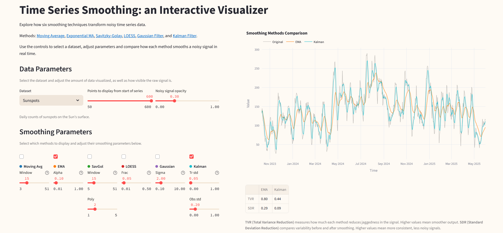

  

# Time Series Smoothing Visualizer

An interactive Streamlit app for exploring time series smoothing methods across a variety of datasets. 

The app was built to demonstrate different smoothing techniques and how they affect noisy time series data.

The methods visualized are: Moving Average, Estimated Moving Average, Savitzky-Golay, LOESS, Gaussian filter, and Kalman filter.

This directory also includes a notebook with some initial plotting and exploration of the noisy sine dataset.

## Datasets and Licensing

This project uses a mix of real-world and synthetic datasets. Below are the sources and licensing information:

- **Sunspots**  
  Daily total sunspot numbers from [SILSO](https://www.sidc.be/SILSO/datafiles). Licensed under [CC BY-NC 4.0](https://creativecommons.org/licenses/by-nc/4.0/).

- **Humidity (RH)** and **Wind Speed (WV)**  
  Weather time series from [Weather Long-term Time Series Forecasting](https://www.kaggle.com/datasets/alistairking/weather-long-term-time-series-forecasting) on Kaggle. Licensed under the [MIT License](https://www.mit.edu/~amini/LICENSE.md).

- **Noisy Sine**  
  Synthetic noisy sine wave generated for this project.

- **Process Modes and Anomalies**  
  Synthetic dataset simulating different industrial operating modes and injected anomalies, created for this project.

