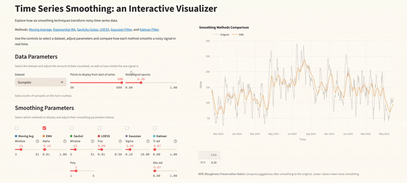

  

# Time Series Smoothing: an Interactive Visualizer

<a href="https://timeseriessmoothing.streamlit.app/" target="_blank">▶ Try the App</a>

This repository contains the code for a Streamlit app that visualizes time series smoothing techniques. It includes both real and synthetic datasets and lets you compare how different methods behave with adjustable parameters.

**Features**
- Adjustable smoothing parameters
- Visual comparison across methods
- 5 datasets

**Supported methods**
- Moving Average
- Exponential Moving Average
- Savitzky-Golay
- LOESS
- Gaussian Filter
- Kalman Filter

## Datasets

This project uses a mix of real-world and synthetic datasets. Below are the sources and licensing information:

- **Sunspots**  
  Daily total sunspot numbers from [SILSO](https://www.sidc.be/SILSO/datafiles). Licensed under [CC BY-NC 4.0](https://creativecommons.org/licenses/by-nc/4.0/).

- **Humidity (RH)** and **Wind Speed (WV)**  
  Weather time series from [Weather Long-term Time Series Forecasting](https://www.kaggle.com/datasets/alistairking/weather-long-term-time-series-forecasting) on Kaggle. Licensed under the [MIT License](https://www.mit.edu/~amini/LICENSE.md).

- **Noisy Sine**  
  Synthetic noisy sine wave, created for this project.

- **Process Anomalies**  
  Synthetic dataset simulating different industrial operating modes and injected anomalies, created for this project.

